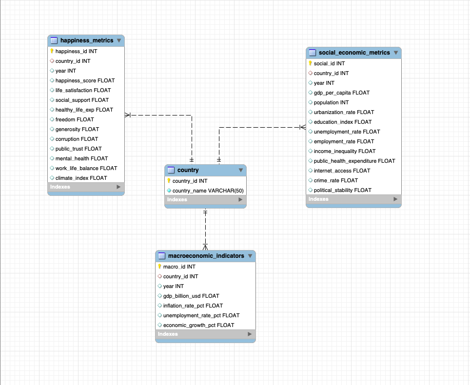

# Wellbeing Analysis: From Data to Insight

A complete data pipeline that integrates socio-economic and macroeconomic datasets into a relational database, performs analytical SQL queries, and visualizes the determinants of national wellbeing (happiness) across countries and years.

---

## Research Questions

1. **Which socio-economic factors are most strongly associated with national wellbeing across countries?**  
2. **How do macroeconomic conditions (inflation, unemployment, growth) influence changes in wellbeing over time?**

---

## Key Findings

- Wellbeing (happiness) remains **relatively stable over time** across countries  
- **GDP per capita** shows the strongest and most consistent association with higher wellbeing  
- **Inflation and unemployment** exhibit **weak and inconsistent relationships** with wellbeing  
- Yearly changes in happiness are **small and centered around zero**, indicating low volatility  
- Differences in volatility across countries are **minimal**, suggesting similar stability patterns globally  

---

## Database Schema

The dataset is normalized into four relational tables:

- `happiness_metrics`
- `social_economic_metrics`
- `macroeconomic_indicators`
- `country`



---

## Project Structure

```
├── README.md
├── schema image.png

├── data/
│ ├── raw/
│ │ ├── Economic Indicators And Inflation.csv
│ │ ├── world_happiness_report.csv
│ │ ├── Economic Indicators.ipynb
│ │ └── Happiness Indicators.ipynb
│ │
│ ├── processed/
│ │ ├── countries.csv
│ │ ├── happiness_metrics.csv
│ │ ├── macroeconomic_indicators.csv
│ │ └── social_economic_metrics.csv
│ │
│ └── queries/
│ ├── average wellbeing score x country.csv
│ ├── GDP in relation to wellbeing.csv
│ ├── top-3-countries-per-year.csv
│ ├── variance within countries.csv
│ ├── wellbeing - inflation - unemployment.csv
│ ├── wellbeing score x country x year.csv
│ └── wellbeing x year.csv

├── sql schema/
│ ├── creation&import.sql
│ └── script.sql

├── data-processing.ipynb # Data cleaning & transformation
├── data-analysis.ipynb # Main exploratory analysis
├── final_analysis.ipynb # Final analysis with visuals
```

---

## How to Reproduce

1. **Data preparation**  
   Clean and merge datasets using Python (Pandas) in `data-analysis.ipynb`.

2. **Create the database**  
   Run `create_schema.sql` in MySQL Workbench to create all tables.

3. **Import data**  
   Load processed CSV files into:
   - `country`
   - `happiness_metrics`
   - `social_economic_metrics`
   - `macroeconomic_indicators`

4. **Run SQL analysis**  
   Execute `queries.sql` to generate:
   - country-level comparisons  
   - macroeconomic vs wellbeing analysis  
   - time-based variation metrics  

5. **Visualize results**  
   Use `final_analysis.ipynb` to:
   - create bar charts (country comparison)  
   - plot volatility and yearly changes  
   - analyze relationships between variables  

---

## Tools

- **Python** — Pandas, Seaborn, Matplotlib  
- **SQL** — MySQL Workbench  
- **Jupyter Notebook** — Data analysis and visualization  

---

## Data Sources

- Socio-economic indicators dataset  
- Macroeconomic indicators dataset  
- Happiness / wellbeing dataset  

---

## Summary

This project demonstrates that **long-term structural factors**, rather than short-term macroeconomic fluctuations, are the primary drivers of national wellbeing. While inflation and unemployment vary significantly, happiness remains stable, highlighting the importance of economic development, institutions, and quality of life.


